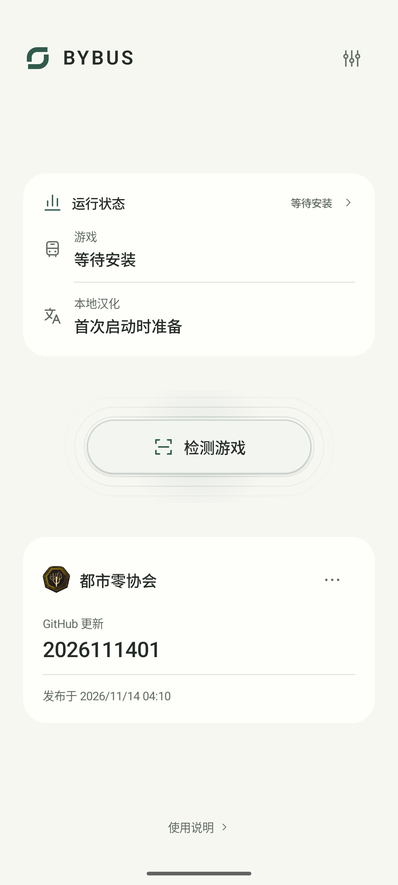
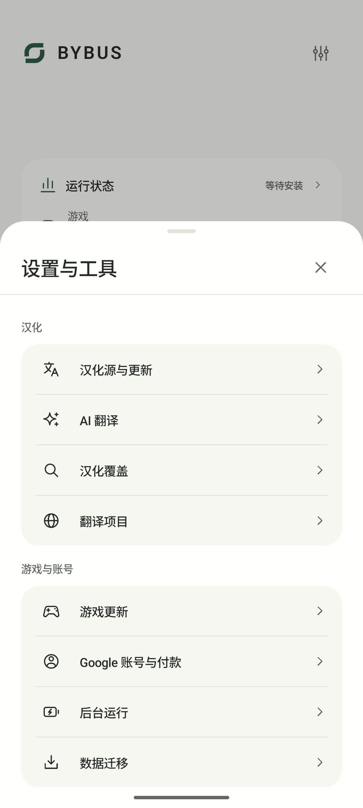

  

<h1 align="center">BYBUS</h1>

  安卓/Android《边狱巴士》中文启动器 
  自由选择汉化 · 免 Root · 不绑定加速器

  
  
  

  <a href="https://github.com/gravere/BYBUS/releases/latest/download/BYBUS-Android.apk"><strong>下载完整 APK</strong></a>
  &nbsp;·&nbsp;
  <a href="#开始使用">开始使用</a>
  &nbsp;·&nbsp;
  <a href="https://github.com/gravere/BYBUS/releases/latest">发行说明</a>
  &nbsp;·&nbsp;
  <a href="https://github.com/gravere/BYBUS/issues/new/choose">问题反馈</a>

---

BYBUS 让你在安卓手机和平板上使用中文游玩《边狱巴士》。默认使用[都市零协会](https://github.com/LocalizeLimbusCompany/LocalizeLimbusCompany)汉化，也支持导入自己的汉化包，或接入自己的 API 按需翻译。

**先安装官方《边狱巴士》，不用打开原版，直接打开 BYBUS 跟着提示操作即可。** 汉化准备、游戏登录和首次资源下载都从 BYBUS 完成，以后也从 BYBUS 启动游戏。

## 界面预览

  
  &nbsp;
  
  &nbsp;
  

## 功能特点

- **汉化由你选择** — 在多个来源之间切换，导入本地汉化包，管理名称与图标，也能导出文本备份。
- **接入自己的 AI 翻译** — 按需补译，内置零协风格参考和译名对照，支持自定义提示词；零协更新后可复用已有 AI 译文，也能撤回或恢复默认汉化。
- **装好原版，直接开始** — 免 Root，无需修改游戏安装包。进入游戏前准备汉化，首次下载资源后即可加载已有译文，不用退出重进。
- **无需绑定加速器** — 自备能访问游戏及相关服务的网络即可使用，无需开通特定加速器会员。BYBUS 本身不提供网络加速。
- **换机也能带走资源** — 游戏资源可导出、迁入，接收设备只需由游戏补齐缺少的内容；汉化包也可单独备份。
- **更新、修复集中管理** — 应用更新红点提醒、增量下载、原版更新入口与汉化修复集中在设置中，手机和平板均有对应布局。

## 开始使用

准备一台 **Android 8.0 及以上的安卓手机或平板**，先确认能安装官方原版游戏。使用时需要能访问游戏服务器、GitHub 和所用登录服务（如 Google）的网络；详细设备条件见[适配说明](docs/android-runtime-portability.md)。

1. **安装原版游戏** — 在设备上安装官方《边狱巴士》。安装完成后不用打开它，也不用在原版里下载资源。
2. **安装并打开 BYBUS** — [下载完整 APK](https://github.com/gravere/BYBUS/releases/latest/download/BYBUS-Android.apk) 并安装，打开后按首页提示操作。
3. **进入游戏** — BYBUS 会识别原版、准备汉化并启动游戏。在这个游戏窗口中登录账号、完成首次资源下载，即可游玩。
4. **以后直接从 BYBUS 启动** — 保留已安装的原版；官方发布新版本时按[更新说明](#更新与维护)操作。BYBUS 会按所选汉化源准备资源，默认零协汉化在启动前自动检查更新。

> [!NOTE]
> 按以上步骤，大型游戏资源只需在 BYBUS 中下载一遍。如果你以前已在原版游玩，原版的资源与登录状态不会自动带入 BYBUS；已有兼容资源包可通过[数据迁移](#资源备份与迁移)导入。

使用 Google 登录时，可以直接在游戏登录界面选择 Google，按提示添加或选择账号；也可以提前在「设置与工具 → Google 账号与付款」中添加。手机系统里已登录的 Google 账号不会自动出现在 BYBUS 中，需要在 BYBUS 里添加一次，可以使用同一个账号。商店与付款服务默认开启。

<strong>发行文件怎么选？首次安装请选择完整 APK</strong>

| 文件 | 用途 |
| --- | --- |
| `BYBUS-Android.apk` | 完整安装包，首次安装和手动更新都选它 |
| `bybus-app-update.json`、`SHA256SUMS.txt` | 更新描述与校验值，无需手动安装 |
| Source code | 项目源码，不是安装包 |

## 选择汉化与 AI 翻译

打开「**设置与工具 → 汉化设置 → 汉化源与更新**」，或点击首页运行状态中的汉化一栏。

| 来源 | 使用方式 |
| --- | --- |
| 都市零协会 | 默认来源，启动前自动检查正式汉化包，也可手动检查更新 |
| 本地汉化包 | 导入含兼容游戏文本的 ZIP / 7z 包后选择使用；更新时在管理菜单替换文件 |
| AI 翻译 | 配置自己的 API 地址、模型和 Key，选择处理范围，确认后分批翻译，也可独立生成汉化 |

在「管理当前汉化源」中可更换图标、导出汉化包；本地与 AI 来源还可改名、替换或删除。切换后，下次启动使用所选来源。本地包的检查按钮用于校验文件；AI 来源可检查零协更新，由你决定是否同步。

首页下方卡片默认跟随当前汉化源，也可通过卡片右上角菜单固定显示某个来源。这个选择只改变卡片展示，不改变游戏使用的汉化。点开来源列表中的「都市零协会」，可查看其 GitHub 更新和翻译进度。

AI 翻译处理已下载的游戏文本，测试和翻译会使用你自己的 API 额度；只有你明确开始翻译或选择补译后启动时才会调用 API。已完成的译文会保留，结果单独保存，不覆盖零协原包。API Key 在设备上加密保存，不随诊断或备份导出。

独立翻译会接着上批未完成的条目继续。翻译中可离开页面，从首页的「正在处理」返回；暂停或关闭应用后也能继续。如果暂停时替换了汉化包，任务结果会另存，当前文件不会被覆盖。取消任务只删除本次尚未发布的译文。

填写服务地址后，可点「获取模型」读取上游列表、搜索并选择模型，也可直接手填模型 ID。支持匿名列表的服务无需先填 Key；需要授权的服务会提示填写。获取列表不会开始翻译。

在汉化源或 AI 翻译页面查看「汉化覆盖」，可按类别对照原文和现有译文，再选择处理「未覆盖」「待核对」或两者。检查会匹配公共译文，排除明确的内部备注与未使用内容；待核对也可能是刻意保留的名称，不等于译源漏译。未下载的内容不计入统计，检查不使用 API 额度。

检查结果会保存在本机。开始新补译前需先完成覆盖检查；汉化或游戏文本变动后会提示重新检查，上次结果仍可查看。补译完成后自动检查剩余内容；「未覆盖」与「待核对」分别处理，已验证的旧 AI 译文可复用。

生成后可在 AI 页面「撤回上次 AI 生成」，恢复生成前的汉化和来源选择；已产生的 API 费用不退回。「测试翻译」只测试当前输入，不会保存配置、切换汉化或改变游戏启动状态。

AI 页面提供「全局提示词」，内置按零协公开规范整理的文风参考，可以编辑、单独保存或恢复默认。翻译会参考已下载零协包中的命中译名和邻句，并检查名称、数字与格式；AI 译文仍建议核对。[查看依据与质量说明](docs/ai-translation-quality.md)。

使用 AI 包启动时，发现零协新版本会提示一次，你可以选择：

- **继续当前汉化**：不更新，直接使用已有包。
- **更新后只用零协**：加载新的正式译文。
- **更新零协，保留 AI**：同一条原文只要零协补齐，就使用零协译文。仍缺的沿用已有 AI 译文，不调用 API。
- **更新后继续补译**：先沿用可用译文，再按单批上限补译剩余内容。没有新的条目时，直接使用更新后的汉化，不调用 API。

同一个零协版本不会每次启动都询问，手动检查可重新选择。复用需要本机保留的 AI 生成缓存和原文校验；原文已变、缓存缺失的内容不会强行套用旧译文。旧 AI 包保留，可随时重新选择。

「恢复默认汉化」切回都市零协会，同时保留 AI 包；不再需要的 AI 包可单独删除，删除前会确认。

汉化内容取决于所选包的覆盖范围；尚未翻译的部分保留原文。BYBUS 自带字体，导入时只读取兼容的文本资源，不安装包内插件。

## 更新与维护

每次打开 BYBUS 首页会自动检查应用版本，有新版时显示红点。检查在后台进行，不影响游戏启动；服务器限流时按提示时间重试。

| 更新内容 | 操作入口 |
| --- | --- |
| BYBUS 应用本身 | 设置与工具 → 应用更新 |
| 原版游戏 | 设置与工具 → 游戏更新，按页面提示更新原版 |
| 汉化 | 设置与工具 → 汉化设置 → 汉化源与更新；零协自动跟进，本地包手动替换 |

手动更新时，下载最新完整 APK **覆盖安装**即可保留数据；应用内更新不可用时也可采用此方式。卸载 BYBUS，或在手机系统设置里清除它的应用数据，会删除 BYBUS 内的游戏资源、本地登录信息和设置。

遇到汉化文件或字体加载异常，可打开「设置与工具 → 修复」。修复时会关闭游戏，保留账号和已下载的游戏资源，完成后从首页重新启动。

需要释放空间时，可使用 **BYBUS 内的「设置与工具 → 清除数据」**，确认后清理已下载的游戏资源与缓存。这个操作会保留账号，下次进入游戏需要重新下载资源。

<strong>应用内增量更新是什么？</strong>

应用内更新复用当前 APK 中未变化的内容，只下载需要补齐的部分，再交给系统安装。支持此方式的旧版本可直接更新，不依赖旧版发行文件；能节省多少流量取决于本次变化。

无法复用时会下载完整包，安装仍需足够的临时空间。**首次安装和手动更新始终下载完整 APK，无需寻找增量附件。**

各版本变化见[发行说明](https://github.com/gravere/BYBUS/releases)。Releases 保留最近三个正式构建的发行文件。

## 资源备份与迁移

在「**设置与工具 → 数据迁移**」中选择方向：

- **迁出**：把已下载的游戏资源保存为 ZIP，再传到另一台设备；本机数据保留。
- **迁入**：选择兼容资源 ZIP，补充缺少的文件，保留接收设备的已有资源。版本不同也可导入，由游戏补齐更新。

资源包不包含账号、Google 授权、应用设置或汉化源。新设备仍需安装原版游戏并登录账号；汉化包请在「汉化源与更新」中单独导出、导入。导出时会关闭游戏，操作前有确认提示。

## 文档与贡献

| 文档 | 内容 |
| --- | --- |
| [构建指南](docs/building.md) | 本地环境、编译与打包 |
| [架构说明](docs/project-architecture.md) | 模块职责与运行流程 |
| [汉化源与 AI 翻译](docs/translation-sources.md) | 本地包处理、来源切换与 API 数据边界 |
| [Android 适配说明](docs/android-runtime-portability.md) | 设备条件与已知限制 |
| [第三方声明](THIRD_PARTY_NOTICES.md) | 组件来源、版权与许可 |

欢迎提交建议、[问题反馈](https://github.com/gravere/BYBUS/issues/new/choose)和 Pull Request。反馈表按启动、文字显示、账号与商店、更新与数据、界面和功能建议分组。选择对应入口，说明问题出现在哪一步；截图和诊断包可按需补充。

## 致谢

感谢以下项目提供的汉化资源与基础组件。

| 项目 | 在 BYBUS 中的用途 |
| --- | --- |
| [都市零协会 / LocalizeLimbusCompany](https://github.com/LocalizeLimbusCompany/LocalizeLimbusCompany) | 默认简体中文汉化资源、译文校对与持续更新，以及来源图标 |
| [VirtualApp](https://github.com/ServenScorpion/VirtualApp) | 运行游戏的 Android 应用容器 |
| [microG / GmsCore](https://github.com/microg/GmsCore) | 容器内的 Google 服务与商店兼容组件 |
| [更纱黑体 / Sarasa Gothic](https://github.com/be5invis/Sarasa-Gothic) | 游戏中的中文字体 |
| [Android Open Source Project](https://source.android.com/) 与 [AndroidX](https://developer.android.com/jetpack/androidx) | Android 基础组件、APK 签名验证与界面框架 |
| [Google Material Icons](https://github.com/google/material-design-icons) | 刷新图标 |

同时感谢以下代码贡献：

- [UMP40](https://github.com/UMP40)：原生运行时与 Google 登录兼容修复。
- [BBBEANNN / limbusZhCN](https://github.com/BBBEANNN/limbusZhCN)：资源导入导出的兼容实现，以及部分原生运行时修复。

具体代码来源、组件版本与许可见[第三方声明](THIRD_PARTY_NOTICES.md)。

## 许可证

项目原创代码采用 [GPL v3](LICENSE)。第三方组件和翻译保留各自版权与许可，详见 [THIRD_PARTY_NOTICES.md](THIRD_PARTY_NOTICES.md)。

BYBUS 是非官方社区项目，与 Project Moon 无隶属关系。
